# Tune-A-VideKO :video_camera:🇰🇷  
<p align="center">
  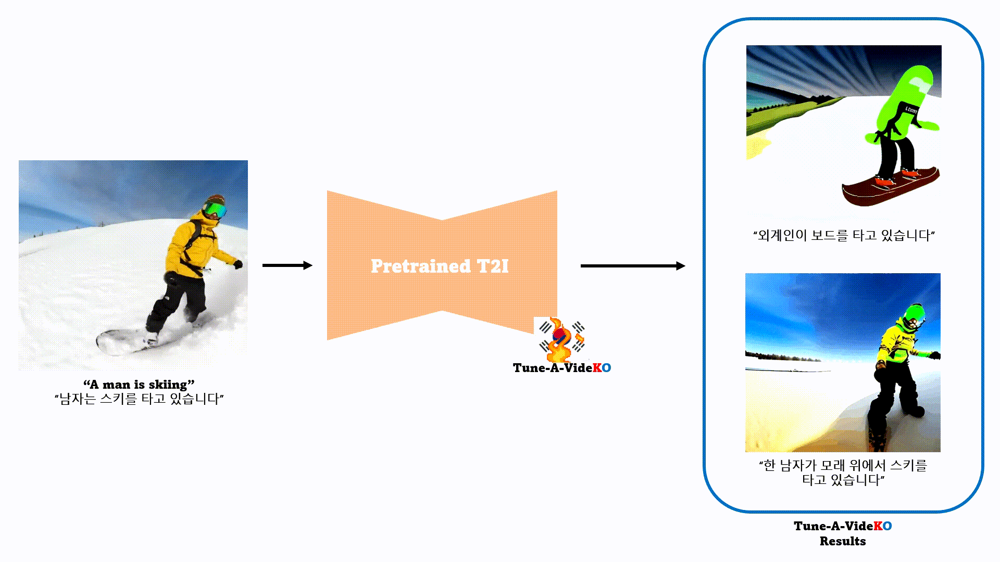
</p>  
  
**One-shot video tuning with Korean-Stable Diffusion** 
- Tune-A-VideKO-v1-5(🐇)🥰: [](https://huggingface.co/kyujinpy/Tune-A-VideKO-v1-5)
- Tune-A-VideKO-v1-5(🌊)🥰:  
- Tune-A-VideKO-anything😍: [](https://huggingface.co/kyujinpy/Tune-A-VideKO-anything)
- Tune-A-VideKO-disney🤩: [](https://huggingface.co/kyujinpy/Tune-A-VideKO-disney)  
  
# Introduction
- 한국어 기반 [stable-diffusion](https://arxiv.org/abs/2112.10752)을 활용하여 [Tune-A-Video](https://github.com/showlab/Tune-A-Video/tree/main)를 접목한 **Tune-A-VideKO**입니다!
- Bingsu님의 [CLIP-VIT](https://huggingface.co/Bingsu/clip-vit-large-patch14-ko/tree/main)를 활용한 [korean-stable-diffusion](https://huggingface.co/Bingsu/my-korean-stable-diffusion-v1-5)를 응용하여 만들었습니다.
  
# Setup
[Tune-A-Video](https://github.com/showlab/Tune-A-Video/tree/main)  
[Pytorch](https://pytorch.org/)==1.12.1  
🤗[Diffusers](https://huggingface.co/docs/diffusers/index)  
  
# Quick Start (training and inference code)
```
Tune-A-VideKO.ipynb # Tune-A-VideKO-v1-5
Tune-A-VideKO-anyhthing.ipynb
Tune-A-VideKO-disney.ipynb 
```
- Quick_Rabbit🐇: [](https://colab.research.google.com/drive/1TKYR0Gj2yuHHzDOeDEi1QtYHgfa3VEY4?usp=sharing)
- Quick_disney🤩:
    
# Results
### Pretrained T2I (tune-a-videKO-v1-5) :baby_chick:  

<table class="center">
<tr>
  <td style="text-align:center;"><b>Input Video</b></td>
  <td style="text-align:center;" colspan="3"><b>Output Video</b></td>
</tr>
<tr>
  <td>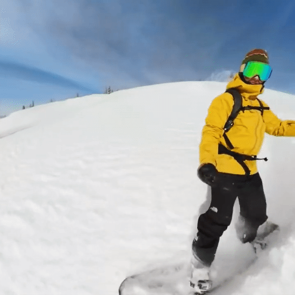</td>
  <td>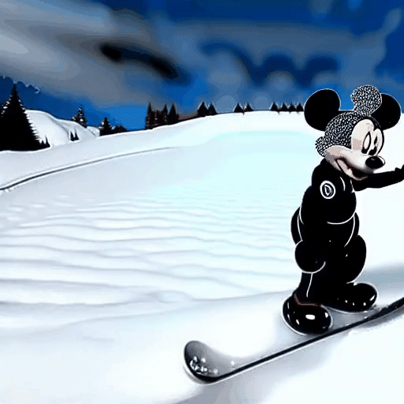</td>
  <td>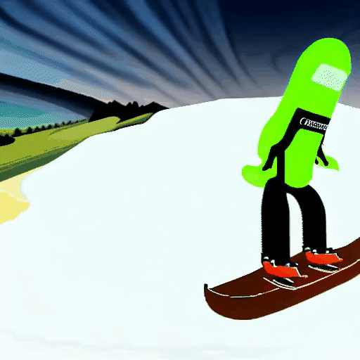</td>              
  <td>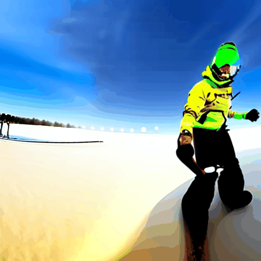</td>
</tr>
<tr>
  <td width=25% style="text-align:center;color:gray;">"A man is skiing"</td>
  <td width=25% style="text-align:center;">"미키 마우스가 눈 위에서 스키를 타고 있습니다”</td>
  <td width=25% style="text-align:center;">"외계인이 보드를 타고 있습니다"</td>
  <td width=25% style="text-align:center;">"한 남자가 모래 위에서 스키를 타고 있습니다"</td>
</tr>

<tr>
  <td>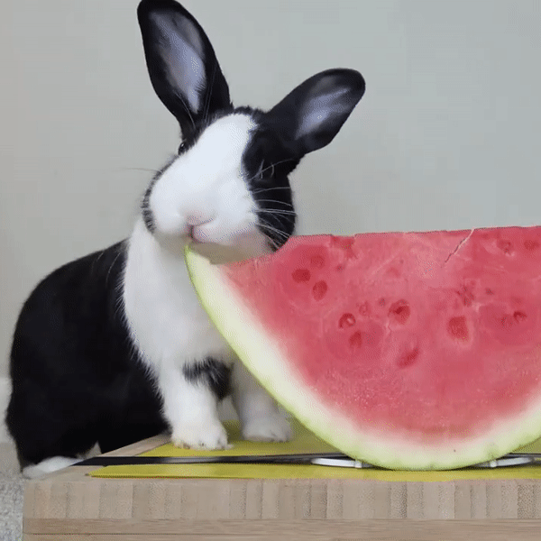</td>
  <td>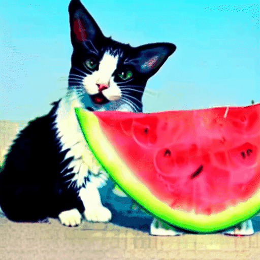</td>
  <td>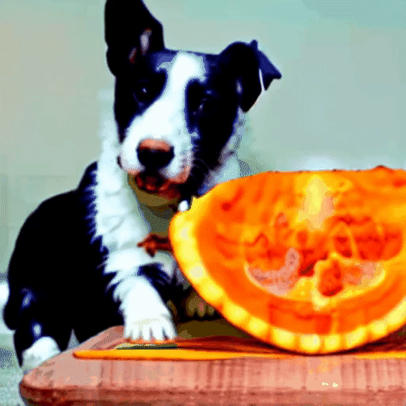</td>           
  <td>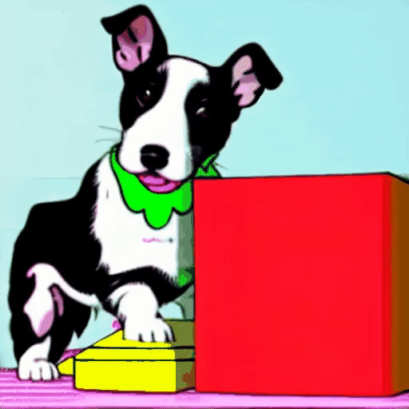</td>
</tr>
<tr>
  <td width=25% style="text-align:center;color:gray;">"A rabbit is eating a watermelon on the table"</td>
  <td width=25% style="text-align:center;">"고양이가 해변에서 수박을 먹고 있습니다"</td>
  <td width=25% style="text-align:center;">"강아지가 오렌지를 먹고 있습니다"</td>
  <td width=25% style="text-align:center;">"강아지가 만화 스타일로 상자를 먹고 있습니다"</td>
</tr>

<tr>
  <td></td>
  <td>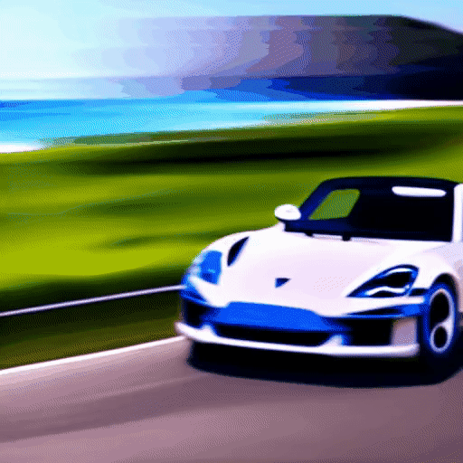</td>
  <td></td>            
  <td>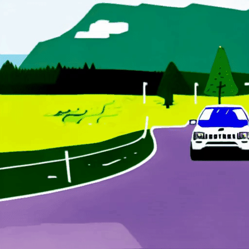</td>
</tr>
<tr>
  <td width=25% style="text-align:center;color:gray;">"A jeep car is moving on the road"</td>
  <td width=25% style="text-align:center;">"포르쉐 자동차가 해변을 달리고 있습니다"</td>
  <td width=25% style="text-align:center;">"자동차가 눈 위를 달리고 있습니다"</td>
  <td width=25% style="text-align:center;">"자동차가 만화 스타일로 도로를 달리고 있습니다"</td>
</tr>

<tr>
  <td></td>
  <td>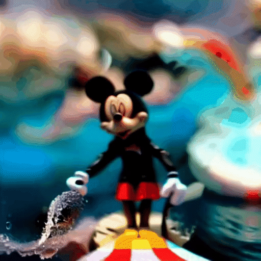</td>
  <td>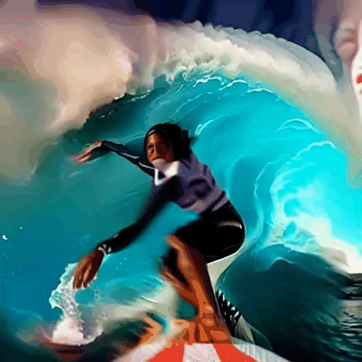</td>            
  <td></td>
</tr>
<tr>
  <td width=25% style="text-align:center;color:gray;">"A man is surfing"</td>
  <td width=25% style="text-align:center;">"미키마우스가 서핑을 타고 있습니다"</td>
  <td width=25% style="text-align:center;">"한 여자가 서핑을 타고 있습니다"</td>
  <td width=25% style="text-align:center;">"흰색 옷을 입은 남자가 바다를 걷고 있습니다"</td>
</tr>
</table>
  
### Pretrained T2I (tune-a-videKO-anything) :hatching_chick:  
<table class="center">
<tr>
  <td style="text-align:center;"><b>Input Video</b></td>
  <td style="text-align:center;" colspan="3"><b>Output Video</b></td>
</tr>
<tr>
  <td>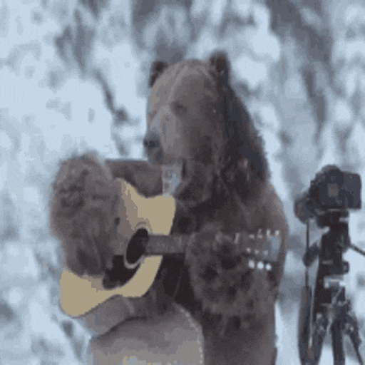</td>
  <td></td>
  <td></td>              
  <td></td>
</tr>
<tr>
  <td width=25% style="text-align:center;color:gray;">"A bear is playing guitar"</td>
  <td width=25% style="text-align:center;">"1소녀는 기타를 연주하고 있다, 흰 머리, 중간 머리, 고양이 귀, 귀여운, 스카프, 재킷, 야외, 거리, 소녀”</td>
  <td width=25% style="text-align:center;">"1소녀가 기타 연주를 하고 있습니다, 바다, 눈을 감음, 긴 머리, 카리스마"</td>
  <td width=25% style="text-align:center;">"1소년, 기타 연주, 잘생김, 앉아있는, 빨간색 기타, 해변"</td>
</tr>
</table>


### Pretrained T2I(tune-a-videKO-disney) :chicken: (Coming soon...)  
  
# TODO
- [x] Make Colab code
- [x] Upload original code
- [ ] Share Tune-A-VideKO-anything
- [x] Share Tune-A-VideKO-v1-5
- [ ] Share Tune-A-VideKO-disney
- [ ] Share Tune-A-Surfing
  
# Acknowledgement
⭐[KO-stable-diffusion](https://github.com/KyujinHan/KO-stable-diffusion-anything)  
⭐[Tune-A-Video](https://github.com/showlab/Tune-A-Video/tree/main)  
⭐[Bingsu's CLIP](https://huggingface.co/Bingsu/clip-vit-large-patch14-ko)  
[SD](https://github.com/Stability-AI/stablediffusion)  
[DreamBooth](https://dreambooth.github.io/)  
[anything](https://huggingface.co/xyn-ai/anything-v4.0)   
[MO-DI-diffusion](https://huggingface.co/nitrosocke/mo-di-diffusion)  
